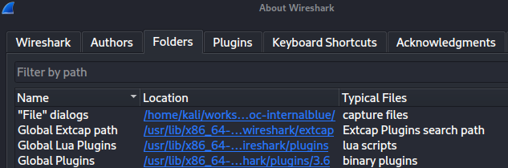
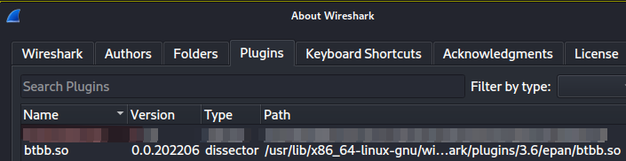
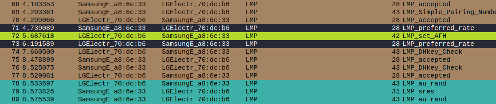

# BTBB plugin for Wireshark 3.6

BTBB Wireshark plugin from the Ubertooth libbtbb project

This is the Bluetooth baseband plugin for Wireshark, it also includes an LMP
level dissector.


## About this repository

This repository contains only the Wireshark dissector without the rest of
the libbtbb library. The dissector was updated to be compatible with
Wireshark 3.6. All credit goes to the original authors of libbtbb. For
additional information see the original repository:

https://github.com/greatscottgadgets/libbtbb


## Build

To build this on Debian/Ubuntu/BackTrack linux distributions:
```
  sudo apt-get install wireshark-dev wireshark
  mkdir build
  cd build
  cmake ..
  make
```
## Install
get the wireshark Global Plugins folder on the "About Wireshark" - "Folders" tab.
Here is /usr/lib/x86_64-linux-gnu/wireshark/plugins/3.6, so copy btbb.so to the epan dir.



```
$ sudo cp btbb.so /usr/lib/x86_64-linux-gnu/wireshark/plugins/3.6/epan
```


## **Install Coloring Rules**

This fork from https://github.com/francozappa/knob/tree/master/wireshark/coloring-rules

To import a coloring rule for the current Wireshark profile, open Wireshark and click on

`View -> Coloring Rules... -> Import`, and then import the relevant file from

the `coloring-rules` folder, e.g., import `lmp` to colorize the LMP protocol.


## Test




open the sample-nexmaster-galaxys9slave.pcapng(fork form https://github.com/francozappa/knob/tree/master/poc-internalblue) file in pcapng folder.


